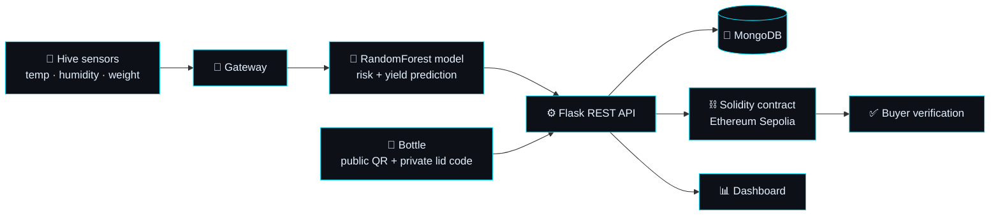
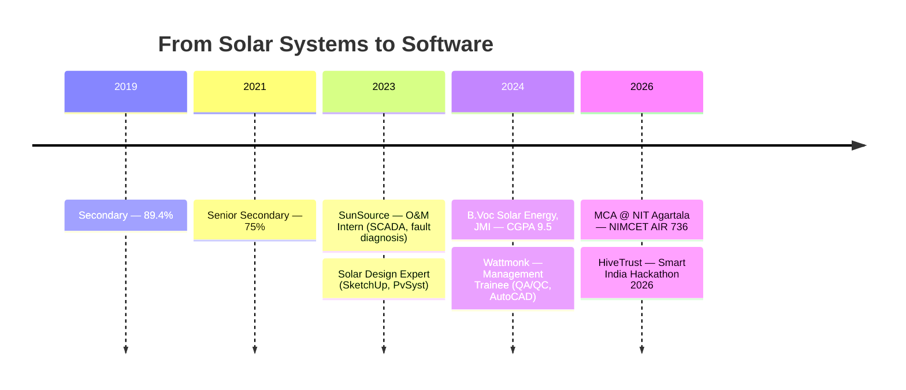

<div align="center">


<br><br>

<a href="https://github.com/aminul821"></a>
<a href="https://github.com/aminul821?tab=followers"></a>
<a href="https://github.com/aminul821?tab=repositories"></a>
<a href="mailto:amansheyak1@gmail.com"></a>


</div>

---

## 👨‍💻 About Me

```text
┌──(aminul㉿nit-agartala)-[~]
└─$ whoami

    Md Aminul Haque

    🎓  MCA @ National Institute of Technology, Agartala  ·  NIMCET AIR 736
    ⚡  B.Voc in Solar Energy, Jamia Millia Islamia  ·  CGPA 9.5
    💻  Python · Flask · REST APIs · MongoDB · MySQL
    🤖  AI, automation and IoT-enabled applications
    🐝  Building HiveTrust for Smart India Hackathon 2026
    🌱  From solar engineering to software — I think in systems
    🎯  Open source, clean APIs, and things that actually ship
```

- 🔭 Currently building **HiveTrust** — AI + IoT + blockchain honey verification for **SIH 2026**
- 🌱 Learning **machine learning, system design and cloud deployment**
- 💬 Ask me about **Python, Flask, MongoDB, IoT dashboards or solar systems**
- 🌐 Portfolio → **[aminul821.github.io/portfolio](https://aminul821.github.io/portfolio/)**
- ⚡ Fun fact: I designed solar plants before I wrote APIs — both are about making data trustworthy

---

## 🛠️ Tech Stack

<div align="center">


<br>


<br><br>


</div>

---

## 🐝 HiveTrust — How It Works



---

## 🚀 Featured Projects

<div align="center">

| Project | What it does | Stack |
|:--|:--|:--|
| 🐝 **[HiveTrust](https://github.com/aminul821/hive)** | AI + IoT + blockchain platform that verifies honey bottles and traces them back to the hive. Built for **SIH 2026** (PS 26021) by Team HexaDevelopers. | `Flask` `MongoDB` `RandomForest` `Solidity` `QR` |
| ⬡ **Hive — Smart Beekeeping** | Hive management with sensor monitoring, gateway integration, bottle verification and analytics. | `Python` `IoT` `Analytics` |
| ⚙️ **Ironman V3** | Python automation suite with a modular architecture and API integration. | `Python` `Automation` `APIs` |
| 🌐 **3D Portfolio** | Interactive Three.js portfolio with a morphing neural-network background, all in one HTML file. | `Three.js` `GLSL` `JavaScript` |

<br>

<a href="https://github.com/aminul821/hive">
  
</a>

</div>

---

## 📊 GitHub Analytics

<div align="center">


<br><br>


<br><br>


<br>


<br><br>


</div>

---

## 🧭 Journey



---

<div align="center">

### 💭 Dev Quote of the Day


</div>

---

## 🤝 Connect With Me

<div align="center">

<a href="mailto:amansheyak1@gmail.com"></a>
<a href="https://www.linkedin.com/in/aminul-haque"></a>
<a href="https://github.com/aminul821"></a>
<a href="https://aminul821.github.io/portfolio/"></a>

<br><br>

*♟️ Chess · 🏏 Cricket · 📚 Reading · 🌐 Open Source*

<br>


**"From sensors to software — build things that people can trust."**

</div>
